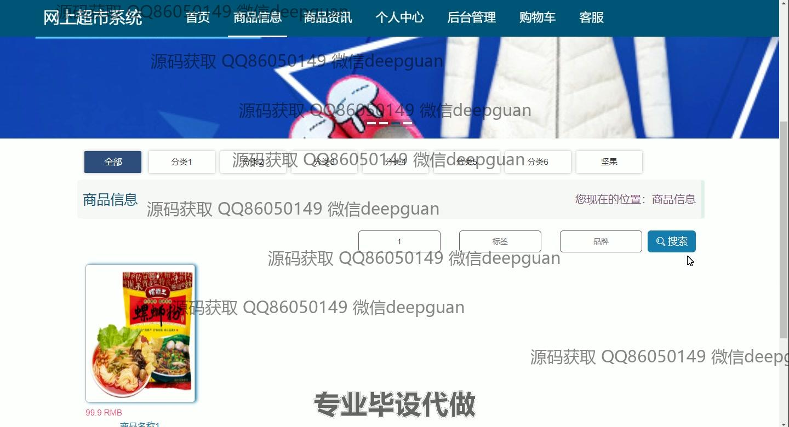

<h1 align="center">基于SpringBoot网上超市的设计与实现</h1>

## 简介
基于SpringBoot的网上超市系统，适用于管理员和用户，功能包括用户管理、商品信息管理、订单管理、购物车、商品评价和客服互动，提供便捷的在线购物体验和高效的后台管理。    --计算机毕业设计源码；毕设源码；java毕业设计源码

## 联系方式

<h3 align="center">获取完整代码与数据库文件 + 微信：deepguan QQ: 86050149 QQ群: 783742310</h3>

<h3 align="center">可帮忙远程部署 包运行成功！提供远程部署、修改代码、设计文档指导、代码讲解等服务！</h3>

## 功能介绍（完整见运行截图）
管理员：管理员在系统中具有广泛的管理权限。基本功能包括登录、管理用户信息和修改个人资料。导航栏提供访问不同模块的快捷方式，如用户管理、商品分类和商品信息管理。管理员可以管理商品信息，包括修改、删除商品以及查看评价。订单管理允许检查和更新订单状态，还可以通过搜索功能查找特定订单。系统还提供客服功能，允许管理员处理客户查询与反馈。管理员可访问后台管理功能以掌握网站运行状况，并在需要时进行调整。

用户：用户在网上超市系统中可以浏览和购买商品。基本功能包括登录、注册和退出。用户主页展示商品推荐和轮播促销信息。用户可以通过搜索功能查找商品，查看商品详情后可以添加到购物车或立即购买。购物车页面允许用户调整商品数量或删除商品，结算页面汇总总价并提供支付选项。在个人中心，用户可以查看和更新个人信息，管理订单和收货地址，并查看收藏的商品。系统还提供友好的在线客服功能，帮助用户解答购物相关问题。

## 运行截图

本代码来源于网络,仅供学习参考使用!

